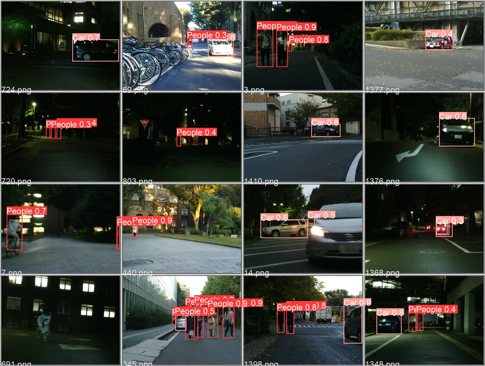
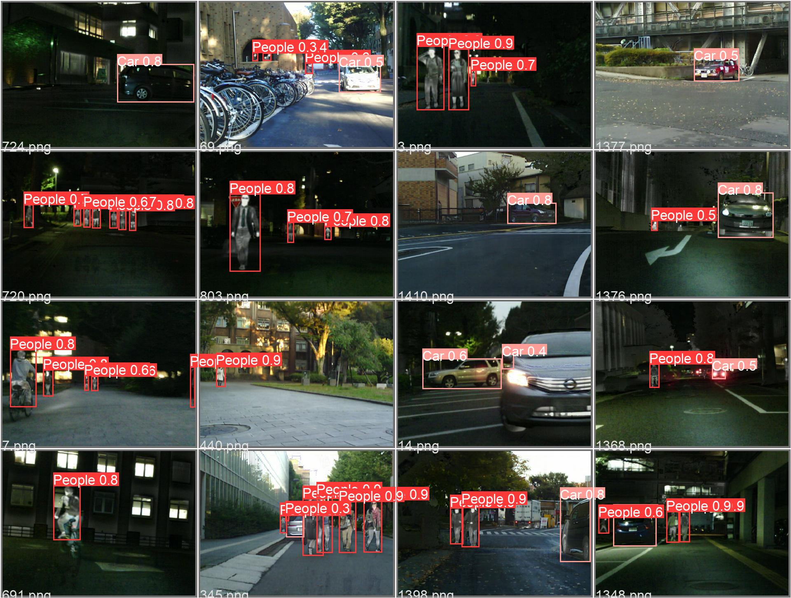
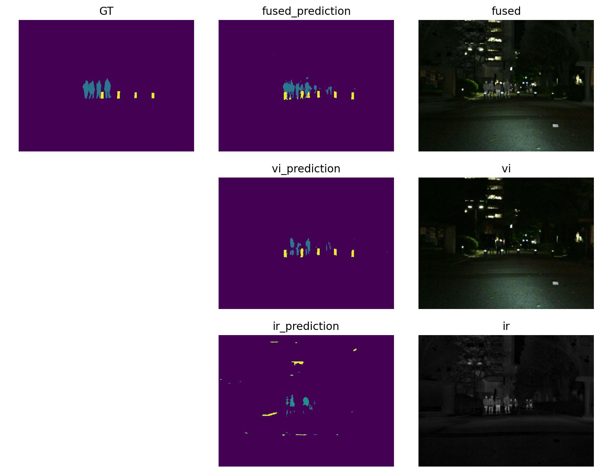
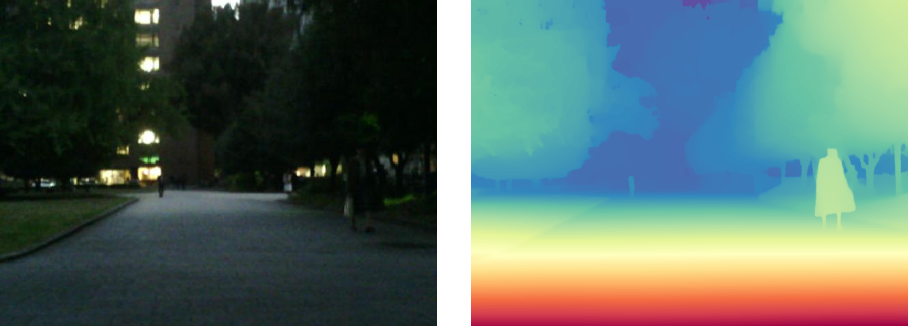
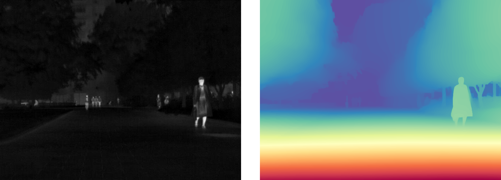
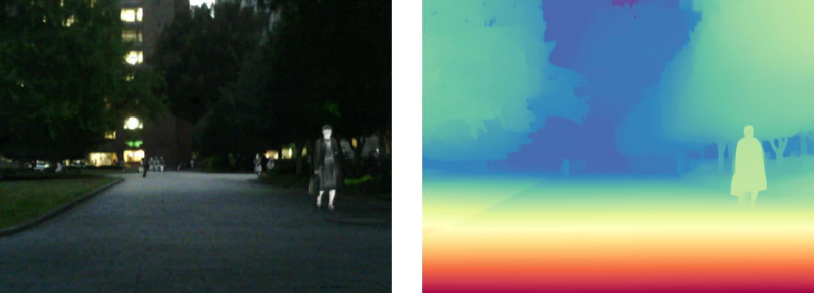

<!-- <div align="center">
<p style="font-size: 20pt;">
Effecient Multi-source Image Fusion Framework
</p> -->

# Effecient Multi-source Image Fusion Framework
<div align="center">
<p style="text-align: center">
     <a href="https://scholar.google.com/citations?user=pv61p_EAAAAJ&hl=en", style="font-size: 18px;">Zihan Cao</a>
     &nbsp
     <a href="https://xiaoxiao-woo.github.io/", style="font-size: 18px;"> Xiao Wu </a>
     &nbsp
     <a href="https://liangjiandeng.github.io/", style="font-size: 18px;"> Liang-Jian Deng </a>
     <br>
     <a style="font-size: 16px;"> University of Electronic Science Technology of China </a>
</p>
</div>


This a repository that allow you to efficiently train your network on multi-source image fusion task, including 

- *Pansharpening*,
- *hyperspectral and multispectral image fusion (HMIF)*,
- *visual and infared image fusion*,
- *medical image fusion*.

> We call the first two as sharpening tasks and the latter two as fusion tasks.

This framework is tested on Python 3.9.x / 3.12 and Pytorch 2.3.0 with CUDA 11.8.


# NEWS✨
2024.07.07: We release codes on some downstream tasks: a) detection task; b) segmentation task. (see `downstreams/` dir for more details.)

2024.06.27: We release VIS-IR and medical image fusion training scripts. 

2024.04.06: Release the some pansharpening and hyperspectral and multispectral image fusion methods. You can found in `model/`.


# Quick Start🎈

## Installation Requirements

You can simply install all needed Python packages by running `pip install -r requirement.txt`.

## Prepare Your Model

You can put in your model and register with the model name that you prefer using `register_model`, then import your model in `model/__init__.py`. 

> We are trying using `hydra` dynamic importing. So, this api may be changed.

Specify your model's `train_step`, `val_step` and `patch_merge_step` (optional) if you are working on *Pansharpening* and *HMIF* tasks, or, if you are working *VIS-IR* and *medical image fusion* tasks, you should specify the `train_fusion_step` and `val_fusion_step` functions.

 You can find detailed example usage in the `model/`.


## Starting Training

Here are two scripts for training your model. 

1. scripts implemented by torch-run.
2. scripts implemented by Huggingface Accelerate. 

> We recommand the latter one.

We take the second choice as the example:

### Sharpening Tasks

For sharpening tasks, you should modify the `scripts/torch_sharpening_run.sh` to feed your model name (after you register it), dataset name, and more options.

Then run it by

```shell
sh scripts/torch_sharpening_run.sh
```

- Train logs and model weights will be saved in `log_file/`.
- Tensorboard logs will be saved in `runs/`.

### Fusion Tasks

For fusion tasks, you should switch to `scripts/accelerate_run.sh` and modify it to suit your way.


### Inference

After you trained your model, you need to infer model on test set.

- For sharpening tasks, you need to put the path of the weight in `inference.py` and run it.

- For fusion tasks, you need to run `scripts/torch_sharpening_run.sh` (after you modify it to suit your model).


## Test Metrics

We provide the Matlab package to test the metrics on those four tasks. Please check them in `Pansharpening_Hyper_SR_Matlab_Test_Package` and `VIS_IR_Matlab_Test_Package`.

### Basic Usage

- For sharpening tasks, you simply test the metrics in Matlab

``` matlab
cd Pansharpening_Hyper_SR_Matlab_Test_Package

%% when testing the reduced-resolution metrics on pansharpening or HMIF tasks
% Args:
% path: the saved fused image `.mat` file, find it in `visualized_img/`
% ratio: upscale ratio, e.g., 4
% full_res: we keep it to 1, not changed
% const: max value of the dataset
analysis_ref_batched_images(path, ratio, full_res, const)

%% when testing full-resolution metrics on pansharpening datasets
% Args:
% path: the saved fused image `.mat` file, find it in `visualized_img/`
% ratio: upscale ratio, e.g., 4
% sensor: the sensor name
analysis_unref_batched_images(path, ratio, sensor)
```


- For fusion tasks, you can run `runDir` in `VIS_IR_Matlab_Test_Package/` in Matlab.

``` matlab
cd VIS_IR_Matlab_Test_Package;

% Args:
% vi_dir: visible images dir
% ir_dir: infrared images dir
% fusion_dir: fused images from your model
% method_name: the name of the method
% test_mode_easy (0 or 1): some metrics may use much time to test;
%                          1 for east, 0 for overall metrics to test.
% test_ext: vi and ir image extension, default to be png.
% fused_ext: fused image extension, default to be png.
runDir(vi_dir, ir_dir, fusion_dir, method_name, test_mode_easy, varargin)

% and also a multiprocessing test matlab script is involved.
mp_run(fusion_dir, dataset_name, method_name, rgb_test, test_mode_easy, varargin)
```
If you find it is troublesome to open an matlab to test, we prepare a python script to help you test with matlab process in background.

```python
python py_run_matlab_VIS_IR_test.py -f <your/fused/path> -m <your_method_name> -d <dataset_name>
```

# Downstream tasks🧨
In VIS-IR fusion task, it's often two choices to test an fusion model with some downstreams tasks, for example: a. *detection*, *segmentation* and *depth estimation*.

In this repo, we introduce two SOTA downstream models to test the fusion models: for detection, we choose YOLOv5 and YOLOv10; for segmentation, we choose MaskFormer and Mask2Former.

## Detection

We follow [LLVIP repo](https://github.com/bupt-ai-cz/LLVIP/tree/main/yolov5), and provide the finetuning and testing code for your fusion model. Please check the script `downstreams/yolov5/train.py` and `downstreams/yolov5/val.py` for effecient training and testing. Here is an example:

<html lang="en">
<!-- <head>
    <meta charset="UTF-8">
    <meta name="viewport" content="width=device-width, initial-scale=1.0">
    <title>排列图像</title>
    <style>
        .image-container img {
            float: center;
            margin-right: 10px; /* 可选：添加间距 */
        }
    </style>
</head> -->
<body>
    <div class="image-container" style="text-align: center;">
        
        
        <div style="font-style: italic; color: gray; text-align: center"> Fig. 1: YOLOv5 detector illustrations before (visible images) and after (fused images) fusion model.
        </div>
    </div>
</body>
</html>


## Semantic Segmentation

We choose recent SOTA segmentation model: MaskFormer and Mask2Former to finetuning a VIS-seg model.
> we found directly appling pretrained (e.g., COCO) segmentation model on fused images would performs worse than VIS images.

The finetuning script `downstreams/segmentation/mask2former/mask2former_ft.py` is modified by huggingface 🤗 training tutorial. You can finetuning any other segmentation model as you want. Please check the huggingface seg-model-card.

Some visualization code is in a notebook `notebooks/downstream_seg_mask2former.ipynb`. Here one example

<div align="center">
  
  <div style="font-style: italic; color: gray"> Fig 2: An example of an segmentation map. Fused image can help the segmentation model to segment finely. </div>
</div>

## Depth Estimation

We use pretrained Deption-Anything v2 to estimate the fused images. A clear estimation perfomance boost can be found by comparing the estimation maps of VIS, IR, and fused images.

<html lang="en">
<body>
    <div class="image-container" style="text-align: center;">
        
        
        
        <div style="font-style: italic; color: gray; text-align: center"> Fig. 3: Depth estimation maps of VIS, IR, and fused images from Depth-Anything v2 model.
        </div>
    </div>
</body>
</html>

# Model Cards

You can find our detailed descriptions of the proposed fusion models at `readmes/`. 

| Models   | Tasks                | Guidance   |
| :------: | :------------------: | :--------: |
| [LE-Mamba (ACM MM 24)](https://arxiv.org/abs/2404.09293) | Pansharpening; HMIF. | [ReadMe](readmes/le-mamba.md) |


# About Dataset

We colloct panshapening, HMIF, VIS-IR image fusion, and medical image fusion datasets from previous works. Really appreciate their great works!

The used datasets includes:
- Pansharpenging: [WorldView-3, GaoFen-2, QuickBird datasets](https://liangjiandeng.github.io/PanCollection.html);
- HMIF: indoor [CAVE and Harvard datasets](https://github.com/shangqideng/PSRT?tab=readme-ov-file#data), remote sensing [Paiva, Houston, Washington datasets](https://github.com/liangjiandeng/HyperPanCollection);
- VIS-IR fusion: MSRS, LLVIP, M3FD, TNO and Roadscene datasets;
- Medical image fusion: MedHavrad SPECT-MRI, PET-MRI, and CT-MRI datasets.

We are planning to release some of them.

# Citation

If you find our works useful, please conside citing the following papers:
```
@article{cao2024novel,
  title={A novel state space model with local enhancement and state sharing for image fusion},
  author={Cao, Zihan and Wu, Xiao and Deng, Liang-Jian and Zhong, Yu},
  journal={arXiv preprint arXiv:2404.09293},
  year={2024}
}

@article{liang2024fourier,
  title={Fourier-enhanced Implicit Neural Fusion Network for Multispectral and Hyperspectral Image Fusion},
  author={Liang, Yu-Jie and Cao, Zihan and Deng, Liang-Jian and Wu, Xiao},
  journal={arXiv preprint arXiv:2404.15174},
  year={2024}
```

And some related works about image fusion may attract you:
```
@article{cao2024neural,
  title={Neural Shr$\backslash$" odinger Bridge Matching for Pansharpening},
  author={Cao, Zihan and Wu, Xiao and Deng, Liang-Jian},
  journal={arXiv preprint arXiv:2404.11416},
  year={2024}
}

@article{cao2024diffusion,
  title={Diffusion model with disentangled modulations for sharpening multispectral and hyperspectral images},
  author={Cao, Zihan and Cao, Shiqi and Deng, Liang-Jian and Wu, Xiao and Hou, Junming and Vivone, Gemine},
  journal={Information Fusion},
  volume={104},
  pages={102158},
  year={2024},
  publisher={Elsevier}
}

@article{zhong2024ssdiff,
  title={SSDiff: Spatial-spectral Integrated Diffusion Model for Remote Sensing Pansharpening},
  author={Zhong, Yu and Wu, Xiao and Deng, Liang-Jian and Cao, Zihan},
  journal={arXiv preprint arXiv:2404.11537},
  year={2024}
}
```